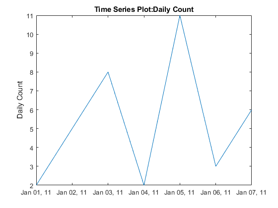
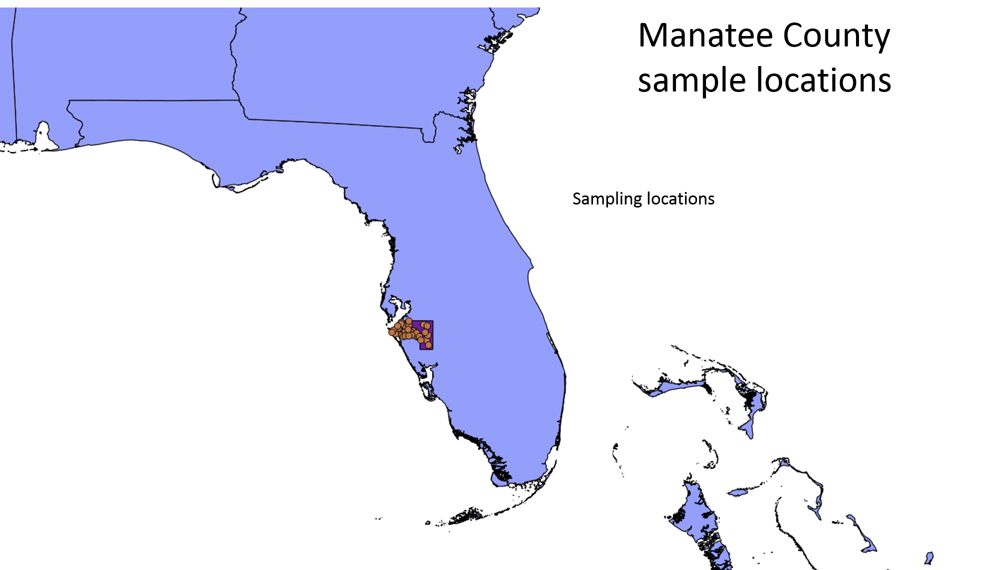
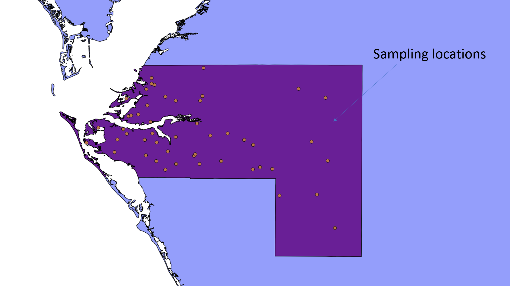

```{r setup, include=FALSE}
knitr::opts_chunk$set(echo = TRUE)
```
# Intro

VecDyn is a global database for spatially and temporally explicit presence-absence and abundance data. We accept and distribute data for animal and plant disease vectors. 

For your projects you will be dealing with abundance data, which can be visualized as simple time-series plot. The Y access represents the abundance of something at a particular point in time, in our case it will be a species of insect, and the X access represents when a sample was measured or taken.  

Example:



## Overview of data collection

Along with the time series data, we need minimal amounts of information,  that can help us make informed decisions about the quality of the data e.g. was it measured accurately using the best equipment and do the sampling methods used to select the sample represent the population in question. These concepts can be represented as follows:

- **What** – description of the sample collected – (e.g. species, count)
- **When** –  temporal information about time of collection. 
- **Where** – geographical information about where the collection took place. 
- **How** – operational information about how the collections were made. 
- **Who**  – who has responsibility for the collection

### General information about the VecDyn template

VecDyn data is stored in two separate files, one dedicated for storing publication information,  one dedicated for storing time-series data and meta-data (data describing how the data was collected).  Data-sets come in many forms, you may receive a data-set which contains all relevant data in one file or one that is split into several files or sources i.e. publication information from a web page and time series data from a file. 

You may find that you can complete each table partially and you end up with missing fields. You can refer to the 'Data collection models' section below which lists which fields are required.  If you have any doubts we can decide if the data-set is complete at a later date and even request information from the author if required. 

### Template 

Note that all data frame fields are created in character format,  you'll need to convert them to the correct formats at a later stage. You can use this data frame as a guide to help you convert your data-set to the VecDyn format. You can either import data into into the data frames below or just rename the field names of the data-set you are working on.  However,  you need to make sure all the columns are in the correct order as below,  even if your data set is missing certain fields. In this case you need to create them  and leave them blank. 


```{r}
publication_information_template  <-data.frame(title=character(), 
                 collection_author=character(),
                 dataset_doi=character(),
                 publication_doi = character(),
                 description = character(),
                 url = character(),
                 contact_name=character(),
                 contact_affiliation=character(),
                 email=character(),
                 orcid=character(),
                 dataset_license=character(),
                 data_rights=character(),
                 embargo_release_date=character(),
                 data_set_type=character(),
                 stringsAsFactors=FALSE)

#write.csv(publication_information_template, file = "publication_information_template.csv", row.names = FALSE)

```


```{r}

vecdyn_template  <- data.frame(title = character(),
                             taxon = character(),
                             location_description = character(),
                             study_collection_area = character(),
                             geo_datum = character(),
                             gps_obfuscation_info = character(),
                             species_id_method = character(),
                             study_design = character(),
                             sampling_strategy = character(),
                             sampling_method = character(),
                             sampling_protocol = character(),
                             measurement_unit = character(),
                             value_transform = character(),
                             sample_start_date = character(),
                             sample_start_time = character(),
                             sample_end_date =  character(),
                             sample_end_time = character(),
                             sample_value = character(),
                             sample_sex = character(),
                             sample_stage = character(),
                             sample_location = character(),
                             sample_collection_area = character(),
                             sample_lat_dd = character(),
                             sample_long_dd = character(),
                             sample_environment = character(),
                             additional_location_info = character(),
                             additional_sample_info = character(),
                             sample_name = character(),
                             stringsAsFactors=FALSE)
#write.csv(VecDyn_template, file = "VecDyn_template.csv", row.names = FALSE)
                             
```


### Data collection models 

The following template descriptions should help you to map data to the VecDyn Template. Ignore the field 'Db table', this will only be relevant when we add data to the database. 

#### Publication Information Template

| Field Name            | Required Y/N | Data format | Details                                                      | Additional Notes                                             |        Db table         |
| --------------------- | ------------ | ----------- | ------------------------------------------------------------ | ------------------------------------------------------------ | :---------------------: |
| title                 | Yes          | String      | Short title identifying the data set and the time frame  in which the study was conducted | E.g. “Mosquito Surveillance in Iowa 2016-2019”              | Publication Information |
| collection_author     | Yes          | String      | Name of collection author                                    | E.g. name of a government authority, university department or individual researcher. | Publication Information |
| dataset_doi    | No           | String      | Digital Object Identifier (DOI) of the the data-set           | If the data set was already published                        | Publication Information |
| publication_doi    | No           | String      | Second Digital Object Identifier (DOI)                       | If connected to a published article                          | Publication Information |
| description           | Yes          | String      | A short description about the data-set and the study  objectives | E.g. ‘Long term municipal surveillance of West Nile vector population in Athens, Greece (2000-2010)” | Publication Information |
| url | No | String (URL) | web link to data-set source |  |  |
| contact_name          | Yes        | String      | Name of person that may be contacted with inquiries about the data | E.g. name  of the person who may be contacted with inquiries about the data-set. This could also be the collection author, the person who compiled the data-set or the up-loader if there is not appropriate information. | Publication Information |
| contact_affiliation   | No           | String      | Author/contact affiliation                                   | If different from collection author                          | Publication Information |
| email                 | No           | String      | Contact email address                                        | Email address of the person who may be contacted with inquiries about the data-set. | Publication Information |
| orchid              | No           | String      | Open Researcher and Contributor ID                           | A unique code used to identify scientific/academic authors and contributors | Publication Information |
| dataset_license       | No           | String      | Creative commons license identification or equivalent.       | Where possible provide a creative commons license identification. See https://creativecommons.org  for more information. | Publication information |
| data_rights | Yes | String | The data reuse policy  for the data set. | Write 'open' if available to the public, 'closed' If data is only available to certain groups or  'embargo' along with release date if under embargo. | Publication information |
| embargo_release_date | No | Date | ISO 8601 date format (YYYY-MM-DD) | Date when the data-set will be freed from the embargo | Publication information |

#### Main Data Collection Template

| Field Name            | Required Y/N | Data format | Details                                                      | Additional Notes                                             |        Db table         |
| --------------------- | ------------ | ----------- | ------------------------------------------------------------ | ------------------------------------------------------------ | :---------------------: |
| title                 | Yes          | String      | Should be the same as the publication information title identifying the data set and the time frame  in which the study was conducted. | E.g. “Mosquito Surveillance in Iowa 2016-2019” | Publication Information |
| taxon                 | Yes          | String      | Classification of sample collected                           | We only need the species name. taxonomic information is standardized when importing data into the database web app. |     Study Metadata      |
| location_description  | Yes          | String      | General description of study location. note that sample locations are treated differently to study location. | In order of smallest geographic subdivision e.g.  district, town, county, state, country |     Study Metadata      |
| study_collection_area | No           | String      | The spatial extent (bounding box, area or volume) of the study. | Information supplied here should represent the total study area. A study area could contain multiple sample sites. Note that bounding box information should be separated with a comma in the following order North, East South, West. |     Study Metadata      |
| geo_datum             | No           | String      | Geodetic datum                                               | E.g. WGS 84                                                  |     Study Metadata      |
| gps_obfuscation_info     | No           | String                            | GPS obfuscation information                                  | If GPS data obfuscation (e.g. GPS points are intentionally offset from their actual locations) or de-resolution occurs (e.g. GPS precision is intentionally reduced) , a statement on the manner by which this occurred. “GPS locations have been truncated to 3 decimals”; “GPS locations obfuscated using N-Dispersion”;  ”No GPS de-resolution was performed” |Study Metadata |
| species_id_method | No   | String | Species identification method | A description of the methods used to identify the species e.g. “Morphological”  or  "Genotype". | Study Metadata |
| study_design             | No           | String                            | Study design methodology                                     | Indicate if observational study i.e. prospective, retrospective, or experimental etc |     Study Metadata      |
| sampling_strategy        | No           | String                            | Sampling_strategy, indicate the strategy used to select the sample | E.g. Probability sampling techniques, such as simple random sampling, systematic random sampling and stratified random sampling. Non-probability sampling techniques , such as self-selection sampling, convenience sampling, snowball sampling and purposive sampling. |     Study Metadata      |
| sampling_method          | No           | String                            | Sampling apparatus e.g.trap type, observation method used to sample the entities. | E.g.    “CDC light trap” ,      “Tick drag”,      “Quadrat count”,       “BG Sentinel Trap” ,      “Pitfall trap”,       “Larval dip”,      “Johnson suction trap”,        or “Lindgren Funnel Trap” |     Study Metadata      |
| sampling_protocol        | No           | String                            | How entities were sample                                     | The sampling protocol can further describe any distinguishing procedures used during sample collection e.g. if traps were set at specific times of day, or under specific weather conditions. Furthermore, this field should be used to describe any attractants/lures used to attract entities to a trap or collection site. |     Study Metadata      |
| measurement_unit         | Yes          | String                            | Description of exactly what was observed, the unit for “Value” | ‘Count’, ‘Count (millions)’, ‘Harvest’, ‘Index of abundance’, ‘Index of territories’, ‘Leaf area’, ‘Mean Count’, ‘Not Specified’, ‘Percent cover’ and ‘Sample’ |     Study Metadata      |
| value_transform          | No           | String                            | Note if the original values have been transformed – list details of the reference value of any data transformation | E.g .Base Year, Log, Proportion                              |     Study Metadata      |
| sample_start_date        | No           | ISO 8601 date format (YYYY-MM-DD) | Date the data collection started                             | Note this field is only required when samples /observations were made between specific time frames |    Time Series data     |
| sample_start_time        | No           | ISO 8601 time format (hh:mm:ss)   | Time the data collection started                             | Note this field is only required when samples /observations were made between specific time frames |    Time Series data     |
| sample_end_date          | Yes          | ISO 8601 date format (YYYY-MM-DD) | Date the data collection ended                               |                                                              |    Time Series data     |
| sample_end_time          | No           | ISO 8601 time format (hh:mm:ss)   | Time the data collection ended                               |                                                              |    Time Series data     |
| sample_value             | Yes          | Integer/float                     | The numerical amount or result from the sample collection    | If presence / absence data, then values should be provided as 1 = species present & 0 = species absent |    Time Series data     |
| sample_sex               | No           | String                            | Information on the sex of the organism sampled               |                                                              |    Time Series data     |
| sample_stage             | No           | String                            | Information on the life stage of the organism sampled        | E.g adult, egg, larva, pupa                                  |    Time Series data     |
| sample_location          | No           | String                            | Name of specific sample location                             |                                                              |    Time Series data     |
| sample_collection_area   | No           | string                            | Area of sample location.                                 | If relevant (*e.g*., when collection method is transect or quadrat), in units of area or volume, the spatial coverage of the sampling unit. Note that bounding box information should be separated with a comma in the following order North, East South, West. |    Time Series data     |
| sample_latitude_dd     | No           | Float                             | Latitude of sample area as a decimal degree Specific location of the sample | Ranges [-90,+90] for latitude (north-south measurement)      |    Time Series data     |
| sample_longitude_dd    | No           | Float                             | Longitude of sample area as a decimal degree                 | Ranges [-180,180] for longitude (east-west measurement)      |    Time Series data     |
| sample_environment | No | String | Additional c information relating to the environment | Should be used to describe specific information about the location / environment e.g.  forest, field , urban area; elevation. | Time Series data |
| additional_location_info | No           | String                            | Additional geographic information                            | Should be used to describe specific information about the location e.g. near to house, near playing fields, Near to population of farm animals |    Time Series data     |
| additional_sample_info   | No           | String                            | Additional sample information                                | Should be used to describe extra or specific information. about conditions at the time of sampling e.g. wind speeds, temperatures, weather. |    Time Series data     |
| sample_name              | No           | String                            | A human readable sample name                                 | May exist solely for the benefit of the depositor in organizing their data, use their own internal naming conventions etc. Naming convention is not restricted, but any encoded metadata should be revealed in the other data fields. For example, you may name a sample named ‘Aphid1_StickyTrap_Jan4,’ but you will still have “Sticky Trap” listed in a Collection Method field, and “Jan 4, 2017” in the date field. |    Time Series data     |

### Special notes on mapping data to the vecdyn template

#### Temporal referencing

- Temporal referencing in the VecDyn database has been kept as straightforward as possible. Collection fields are set up to gather information on the date-time a collection was started and the date-time a collection ended.  Using this information it is easy to calculate information like the duration a trap was set or to calculate the duration of other relevant sampling methods like ecological belt transects or line transects. 

- You'll probably find that most temporal information comes as a standard date. However, it often comes in many different formats and you'll need to convert it to  ISO 8601 date format (YYYY-MM-DD) for it to work with the VecDyn database. 
- If only the month and year are supplied, then you should set the day to 01 e.g. 2001-10-01. Make sure this is mentioned in the 'sampling_protocol' field e.g. state 'only months and years supplied, but day set to 01 or first of each month for database formatting purposes'.  
- If you receive temporal data in a date-time which combines date and time together, you'll need to separate them and add the time to the appropriate time field in the  ISO 8601 time format (hh:mm:ss) . 

#### Spatial referencing

In order to facilitate mapping and geo-spatial analysis, spatial referencing has been set up to track:

1. General information about the study area e.g. in which area of the world it occurred e.g. country, region, municipality. The general study area is standardized in the web-app so it can  aid data visualization and searches, although  it does not necessarily  provide useful statistical information.  Generally, if you are working on a  data-set which contains information on  administrative areas e.g. countries,  states or municipalities,  then this data should be combined and added to the 'location_description' description field,  each administrative division should be separated by a comma. 
2. Specific information about a sample site,  where Global Positioning System (GPS) information can be inputted for each sample along with the name of the sample site. 

The following two figures demonstrates the kind of spatial information that can be captured in the database. 







## Mapping Data to Vecdyn Template

Your challenge will be to clean-up and process data-sets, mapping them to the vecdyn template. Try to map what you can, you might find that some data-sets more information than what is required for the vecdyn database (e.g. the GPDD data has many additional fields we do not need).  Work with R notebooks or rstudio markdown so you can save all your code and we can go back to it at a later date and re-edit if necessary. 

You'll probably need to use a number of packages and techniques to achieve your goal. You should refer to the 'R for Data Science guide'(https://r4ds.had.co.nz/) or materials you have been provided by Imperial.  

You can find the R code which will help you build a vecdyn template under the 'Template' section below. 

## Data Sources

### Project 1: Crop Disease Vectors

#### GDPP

You can check the GDPP data-sets here. (https://vectorbiteonlineplatform.pythonanywhere.com/VectorBiteGPDD/default/index)  

You can find the GDPP user guide in the files folder. 

The GDPP data will pose a slight challenge when converting them to the VecDyn format as the GPDD does not store observations as exact sampling dates,  instead observations are temporally coded. You'll need to convert these into time-stamped dates. More info on this later. 

##### Possible data-sets in the GDPP

    - Rothamsted Insect Survey Annual Report.	Hard Copy - Tabular	Taylor, L.R., Woiwod, I.P., MacCaulay, E.D.M., Dupuch, M.J. & Nicklen, J.	1990	None	Datasource ID: 502
    - Alternation of bottom-up and top-down regulation in a natural population of an agromyzid leafminer, Chromatomyia suikazurae.	Hard Copy - Graphical	Kato, M.	1994	None	Datasource ID:  589
    - Patterns of density dependence in moths and aphids.	Hard Copy - Graphical	Woiwod, I. & Hanski, I.	1992	Read from graphs digitally.	Datasource ID: 749
    - Population dynamics and abundance of deciduous tree - dwelling aphids.	Electronic transfer	Dixon, A.F.G.	1990	None	Datasource ID: 448
    - Regular alternation of high and low population size of gall-forming aphids: analysis of ten years of data.	Hard Copy - Graphical	Wool, D.	1990	None	Datasource ID: 535

##### Other data-sets

    - KBS049: Aphid Collection Tower Site at KBS (https://lter.kbs.msu.edu/datasets/52)

### Project 2: Mosquito Borne Disease Vectors

#### Possible data-sets  

    - https://www.vectorbase.org/popbio  (anything in the PopBio database)
    - https://zenodo.org/communities/vb-popbio/
    - Anastasia Mosquito Control District entomological monitoring. https://zenodo.org/communities/vb-popbio/search?page=1&size=20&q=Anastasia%20Mosquito%20Control%20District%20entomological%20monitoring
    - Laura Harrington culex data (we will send you this in a separate email). CulexCount_Temp_Rainfall


# Questions and Answers

**Is there a dataset which has all the years combined or would I have to concatenate the data?**

Think of this as two slightly different exercises, 1) to clean-up and arrange separate data sets for the vecdyn database and 2) the analysis of these data sets. 

  - 1: For the data clean up you should keep each data set as you find it, for example the Vectorbite data on zenodo is for specific years, each data-set has its own specific title indicating a specific time-frame e.g. Anastasia mosquito 2004. What you could do here is create a script that converts the 2004 data-set to the vecdyn format, then use this code to do the same for subsequent data-sets. Note that some data-sets may be assigned a unique code called a DOI  (a publishing code assigned to each published data-set). Anything with a specific title and DOI should be saved / processed separately.
  
  - 2: As for your analysis, you'll probably need to combine collections together over a number of years e.g. combine all the year of Anastasia mosquito data together to create a time series analysis. 

**Also there are about 37 datasets from different locations in zenodo, but the anastasia mosquito data goes back to 2004, while the data from other locations don't. Would I have to combine all of these datasets together as well and as they are in different formats, how would I go about combining them?. There are a lot more entries from different locations in vectorbase too and I'm not sure how to map all of these different datasets to the vecdyn template efficiently. **

Don't worry about using the data from the vectorbase website (it is a little confusing). For now, just focus on data sets on the vectorbase pop bio data on the zenodo site. They are better prepared than some of the other ones on the vectorbase site i.e contain all relevant information that can be easily found. 

**Could we have some definitions of the new headings? For example: I am unsure of the difference between "sampling_method" and "sampling_strategy"; **

Do you mean you want me to improve the definitions? 

Definitions can be found in the section 'Data collection models'. As for data-sets you are processing, there will need to be some interpretation as to what has been done by the data collector and how this fits into our model. Just make sure you keep notes and everything can be evaluated on a cases by cases basis. 

**I do not know what "value_transform" is for**

Again look under 'Data collection models', 

This might be reported if the originally collected values have been transformed, the transformation method should be reported in this field. 

**I am unsure of the difference of the "sample_start_date" and "sample_start_time" **

One represents a data e.g. day of the year, the other an actually time 14.00. You might find that, particularly for smaller organisms that a time series might need to be created using hours rather than days. 

**Should the "sample_location" be a country/county/town or more specific location in longitude/latitude?; **

Sample location should be a unique location, usually much more specific than a country or county, as this information is to general. However, it could be a town or something way more specific like a neighborhood in a town. 

**What is the difference between the "sample_location" and "sample_collection_area"?**

Sample location will be the name of a given place the sample was taken, sample collection area will be the actually area m2 of a sample location.
Sometimes this may be represented as a geo-spatial bounding box, search on line to see what this is. 

**Also, my data is missing some information that would be needed for the complete mapping, for example the publication doi and a contact email. Do I need to search for this myself**

If you can't find it leave it blank for the moment, we can deal with it at a later date. 

**Finally, how will we link the two different templates (vecdyn_template and publication_information_template)**

Good question, for the moment we'll keep the two  completed templates in separate date-frames/files, they will be linked by the actual database when  upload them. 


# Mapping To The Vecdyn Template Example

Load the following packages (and install if required)

```{r}
# install.packages("tidyverse")
# install.packages("readr")
# install.packages("plyr")
# install.packages("scales")
library(tidyverse)
library(readr)
library(plyr)
library(scales)
library(lubridate)

```

Load up the VecDyn template / data-frame and name it. 

```{r}
vecdyn_mcm_2012  <- data.frame(title = character(),
                             taxon = character(),
                             location_description = character(),
                             study_collection_area = character(),
                             geo_datum = character(),
                             gps_obfuscation_info = character(),
                             species_id_method = character(),
                             study_design = character(),
                             sampling_strategy = character(),
                             sampling_method = character(),
                             sampling_protocol = character(),
                             measurement_unit = character(),
                             value_transform = character(),
                             sample_start_date = character(),
                             sample_start_time = character(),
                             sample_end_date =  character(),
                             sample_end_time = character(),
                             sample_value = numeric(),
                             sample_sex = character(),
                             sample_stage = character(),
                             sample_location = character(),
                             sample_collection_area = character(),
                             sample_lat_dd = character(),
                             sample_long_dd = character(),
                             sample_environment = character(),
                             additional_location_info = character(),
                             additional_sample_info = character(),
                             sample_name = character(),
                             stringsAsFactors=FALSE)
#write.csv(VecDyn_template, file = "VecDyn_template.csv", row.names = FALSE)
                             
```

Import the Manatee County Mosquito Data Set (2012). When importing data-sets, make sure you set '=FALSE' to ensure R doesnt apply any unwanted formatting to the data-frame. 

```{r}
Manatee_County_Mosquito_2012_download <- read.csv(url("https://zenodo.org/record/1217702/files/VectorBase-2012-Manatee_County_Mosquito_Control_District_Florida_USA.csv?download=1"), stringsAsFactors=FALSE)

Manatee_County_Mosquito_2012 <- Manatee_County_Mosquito_2012_download
```

Check the data-frame to see if everything went to plan. 

In this data-set, trap_id, gps_lat, gps_long & location all vary together, in this data-set this represents trap location.  Location_ADM2, location_ADM1, location_country represent the general study location. 

```{r}
head(Manatee_County_Mosquito_2012)
```

One way to map the Manatee_County_Mosquito_2012 data-set to a vecdyn template is to extract values from the original data-frame and add them to the relevant fields in the vecdyn data frame.  

Firstly though, some of the general geo-information about the study location is presented in 3 fields, we need to get this into 1 field.  We can use a tidyr package called unite these 3 fields into one. 

```{r}
Manatee_County_Mosquito_2012 <-
  Manatee_County_Mosquito_2012 %>%
  tidyr::unite("location_description", c("location_ADM2","location_ADM1", "location_country"), sep = ",")

```

We can drop (not include) some of the fields that we do not require from the manatee county data set i.e. collection_ID (recreated in vecdyn db), sample_ID (recreated in vecdyn db), trap_number (no useful info) & trap_duration (specified by collection start and end dates) 

Below, we extract values from Manatee_County_Mosquito_2012 data-frame

```{r}

taxon <- Manatee_County_Mosquito_2012$species

sample_value <- Manatee_County_Mosquito_2012$sample_count

sample_sex <- Manatee_County_Mosquito_2012$sex

sample_stage <-  Manatee_County_Mosquito_2012$developmental_stage 

sample_start_date <- Manatee_County_Mosquito_2012$collection_date_start

sample_end_date <- Manatee_County_Mosquito_2012$collection_date_end

sample_lat_dd <- Manatee_County_Mosquito_2012$GPS_lat

sample_long_dd <- Manatee_County_Mosquito_2012$GPS_lon

sample_location <- Manatee_County_Mosquito_2012$location

location_description <- Manatee_County_Mosquito_2012$location_description

sampling_method <- Manatee_County_Mosquito_2012$attractant

sampling_protocol <- Manatee_County_Mosquito_2012$trap_type

species_id_method <- Manatee_County_Mosquito_2012$identification_method

sample_name <-  Manatee_County_Mosquito_2012$trap_id


```

Next we bind all the extracted values together creating a data-frame, we then bind the newly created data-frame with the vecdyn_mcm_2012 template we created at the beginning. 

```{r}

a <- cbind(taxon, sample_value, sample_sex, sample_stage, sample_start_date, sample_end_date, sample_lat_dd, sample_long_dd, sample_location, location_description, sampling_method, sampling_protocol, species_id_method, sample_name)

a <- data.frame(a, stringsAsFactors=FALSE)

vecdyn_mcm_2012 <- rbind.fill(vecdyn_mcm_2012, a)

```

At this stage you can check to see if the number of observations in the newly created vecdyn_mcm_2012 data-frame match the number of observations in the original manatee county data frame. 

We can now start formatting the data-set so we can produce a time series graph. Convert dates to the Y-m-d format, in the case of this data set the dates are already in the correct format. We also convert the sample_value field to numeric. 

```{r}
vecdyn_mcm_2012 <- 
  vecdyn_mcm_2012 %>%
  dplyr::mutate(sample_end_date = as.Date(as.character(sample_end_date, format = "%Y/%m/%d"))) %>%
  dplyr::mutate(sample_start_date = as.Date(as.character(sample_start_date, format = "%Y/%m/%d"))) %>%
  dplyr::mutate(sample_value = as.numeric(sample_value))


```

Give the data set a title

```{r}

vecdyn_mcm_2012 <- 
  vecdyn_mcm_2012 %>%
  dplyr::mutate(title = 'Manatee_County_Monitoring_2012')


```

Test the data set by producing a time series plot in from our newly created vecdyn data-set and compare it using ggplot. Note that this particular data set contains lots of sampling stations within manatee_county. 


```{r}
vecdyn_mcm_2012  %>%
  dplyr::filter(taxon == "Aedes aegypti")  %>%
  dplyr::select(sample_value, sample_end_date) %>%
  dplyr::group_by(sample_end_date) %>%
  dplyr::summarise(sample_value = sum(sample_value)) %>%
  ggplot(aes(sample_end_date, sample_value)) + geom_line() +
  scale_x_date(labels = date_format("%b/%y"))

```

```{r}

Manatee_County_Mosquito_2012  %>%
  dplyr::filter(species == "Aedes aegypti")  %>%
  dplyr::select(sample_count, collection_date_end) %>%
  dplyr::group_by(collection_date_end) %>%
  dplyr::summarise(sample_count = sum(sample_count)) %>%
  plyr::mutate(collection_date_end = as.Date(as.character(collection_date_end, format = "%Y/%m/%d"))) %>%
  dplyr::mutate(sample_count = as.numeric(sample_count)) %>%
  ggplot(aes(collection_date_end, sample_count)) + geom_line() +
  scale_x_date(labels = date_format("%b/%y"))
  
```

Finally write the data set to CSV, set all missing value to blank ""

```{r}
write_csv(vecdyn_mcm_2012, "vecdyn_mcm_2012.csv", na = "")
```

You can also fill out the be extracting data from the appropriate zenodo page. 

```{r}
vecdyn_mcm_2012_publication_info  <-data.frame(title=character(), 
                 collection_author=character(),
                 dataset_doi=character(),
                 publication_doi = character(),
                 description = character(),
                 url = character(),
                 contact_name=character(),
                 contact_affiliation=character(),
                 email=character(),
                 orcid=character(),
                 dataset_license=character(),
                 data_rights=character(),
                 embargo_release_date=character(),
                 data_set_type=character(),
                 stringsAsFactors=FALSE)

#write.csv(vecdyn_mcm_2012_publication_info, file = "vecdyn_mcm_2012_publication_info.csv", row.names = FALSE)

```

### Linking Vecdyn Data To Climate Data

## RNCEP: Obtain, Organize, and Visualize NCEP Weather Data
Contains functions to retrieve, organize, and visualize weather data from the NCEP/NCAR Reanalysis (http://www.esrl.noaa.gov/psd/data/gridded/data.ncep.reanalysis.html) and NCEP/DOE Reanalysis II (http://www.esrl.noaa.gov/psd/data/gridded/data.ncep.reanalysis2.html) datasets. Data are queried via the Internet and may be obtained for a specified spatial and temporal extent or interpolated to a point in space and time. 

```{r}

vecdyn_mcm_2012$sample_value = as.numeric(vecdyn_mcm_2012$sample_value)
vecdyn_mcm_2012$sample_lat_dd = as.numeric(vecdyn_mcm_2012$sample_lat_dd)
vecdyn_mcm_2012$sample_long_dd = as.numeric(vecdyn_mcm_2012$sample_long_dd)

```

create a time variable, lets say 3pm everyday

#vecdyn_mcm_2012_2$sample_end_date = mdy_hms(vecdyn_mcm_2012_2$sample_end_date)


```{r}
vecdyn_mcm_2012_4pm  <- 
  vecdyn_mcm_2012 %>%
  dplyr::mutate(sample_end_time = "16:00:00") %>%
  dplyr::

```


```{r}
lets insert a time for everydate, say 4 oclock every day


```


## using lubridate
library(lubridate)
> ymd_hms(DateTime,tz=Sys.timezone())
[1] "2007-02-01 EST"
> mdy_hms(DateTime2,tz=Sys.timezone())
[1] "2007-02-01 00:06:10 EST"


```{r}
# install.packages("RNCEP")

library(RNCEP)
## Ensure the vecdyn_mcm_2012 is in your global environment, if not run through the previous Mapping exercise above
## In this example,  we use the datetime and locational data obtained from the trap locations (gps coordinates)

## First, visualize the entire track representing 
## with the point colors ##
## Note the specification of the title
## Also, note the specification of the legend label
## and adjustment of its placement
NCEP.vis.points(wx=vecdyn_mcm_2012$sample_value, lats=vecdyn_mcm_2012$sample_lat_dd, 
    lons=vecdyn_mcm_2012$sample_long_dd)

```


```{r}

## Now collect cloud cover, temperature, and wind
## information for each point in the subset ##

temp <- NCEP.interp(variable='air.sig995', level='surface', lats=vecdyn_mcm_2012$sample_lat_dd, lons=vecdyn_mcm_2012$sample_long_dd, dt=vecdyn_mcm_2012$sample_end_date, reanalysis2=FALSE, keep.unpacking.info=TRUE)

```
cloud <- NCEP.interp(variable='tcdc.eatm', level='gaussian', 
    lat=ss$latitude, lon=ss$longitude, dt=ss$datetime, 
    reanalysis2=TRUE, keep.unpacking.info=TRUE)

uwind <- NCEP.interp(variable='uwnd', level=925, 
    lat=ss$latitude, lon=ss$longitude, dt=ss$datetime,
    reanalysis2=TRUE, keep.unpacking.info=TRUE)
vwind <- NCEP.interp(variable='vwnd', level=925, 
    lat=ss$latitude, lon=ss$longitude, dt=ss$datetime, 
    reanalysis2=TRUE, keep.unpacking.info=TRUE)	

## Now visualize the subset of the GPS track using color
## to indicate the cloud cover ##
## Note the adjustment to the color of the basemap
## And the setting of the map range ##
## And the explicit placement of the colorbar legend
## using the smallplot argument
NCEP.vis.points(wx=cloud, lats=ss$latitude, lons=ss$longitude,
    cols=rev(heat.colors(64)),
    map.args=list(col='darkgreen',xlim=c(-7,4), ylim=c(40,50)),
    title.args=list(main='Lesser black-backed vecdyn_mcm_2012'),
    image.plot.args=list(legend.args=list(text='Cloud Cover %',
        adj=-.1, padj=-.5, cex=1),
    smallplot=c(.83,.86,.15,.85)))

## Now visualize the subset of the GPS track using color
## to indicate the temperature ##
## Note the adjustment of point size
NCEP.vis.points(wx=temp, lats=ss$latitude, lons=ss$longitude,
    cols=rev(heat.colors(64)),
    points.args=list(cex=1.25),
    title.args=list(main='Lesser black-backed vecdyn_mcm_2012'),
    image.plot.args=list(legend.args=list(text='Kelvin',
        adj=-.4, padj=-.5, cex=1.15)),
    map.args=list(xlim=c(-7,4), ylim=c(40,50)))

## Now calculate the tailwind component from the U and V
## wind components assuming that the bird's preferred 
## direction is 225 degrees
tailwind <- (sqrt(uwind^2 + vwind^2)*cos(((atan2(uwind,vwind)*
    (180/pi))-225)*(pi/180)))

## Now visualize the subset of the GPS track using color
## to indicate the tailwind speed ##
## Note the adjustment of grid and axis properties
NCEP.vis.points(wx=tailwind, lats=ss$latitude, lons=ss$longitude,
    cols=rev(heat.colors(64)),
    axis.args=list(las=2), grid.args=list(lty=1),
    title.args=list(main='Lesser black-backed vecdyn_mcm_2012'),
    image.plot.args=list(legend.args=list(text='Tailwind m/s',
        adj=0, padj=-2, cex=1.15)),
    map.args=list(xlim=c(-7,4), ylim=c(40,50)))

## End(Not run)
```

